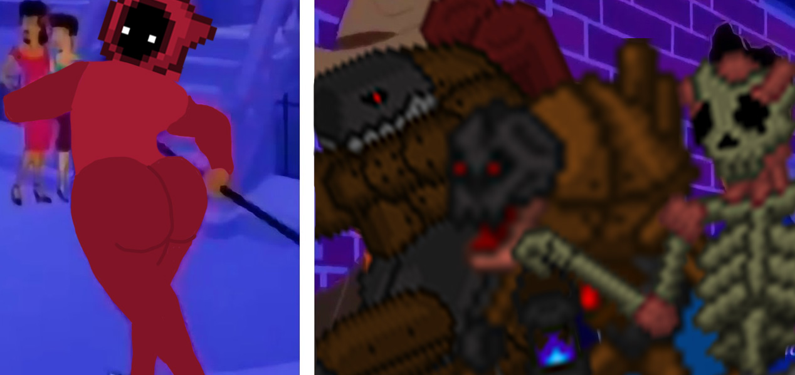

<h1 align = "center">Dungeon</h1>
<h3 align = "center">Dungeon-themed platformer on C# WinForms</h3>

</img>

  
<h3>A game made as part of a project on the basics of programming's discipline in UrFU, release version.</h3>

<h3>Technical features</h3>
<ul>
  <li>C#</li>
  <li>MVC pattern</li>
  <li>NuGet + NAudio library</li>
</ul>

<h3>You can try it, just open .exe in root directory</h3>
